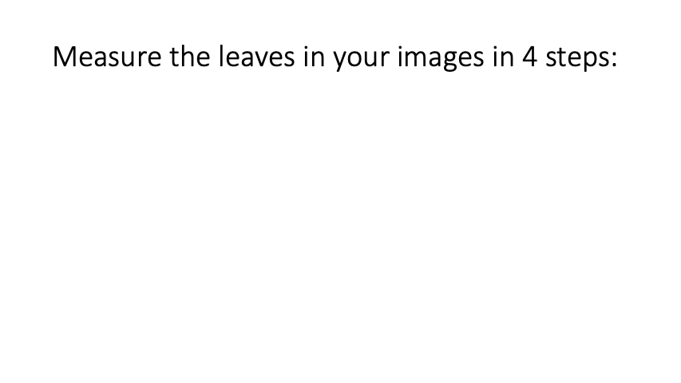
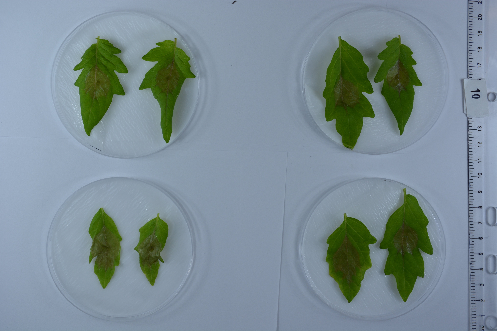

# Application
Leaf Size is a Web application for the measurement size of the leaves and pathogen in your images. The application is specifically designed for high throughput: allow to quantify as many images as possible in the least amount of time.

Try it now at [https://vittorioaccomazzi.github.io/LeafSize/](https://vittorioaccomazzi.github.io/LeafSize/)

    

## Workflow
The steps that the user has take to quantify leaf size and pathogen size are the following:
1. Selection of the images layout:
   1. Number of petri dishes in each image: 1 or 4.
   2. Number of leaves in each petri dish: 1 or 2.
2. Interactively set the settings for the identification of the leaves and patogen regions in the images as follow. At any point in time you can click on `Preview` to view how the image displayed in the page analyzed:
   1. Isolate the leaves: this is accomplished setting two sliders for `Hue` and `Saturation`:
      1. Reducing the hue value will _increase_ the area of the leaves.
      2. Reducing the saturation value will _descrease_ the area of the leaves.
   2. Isolate the pathogen region:
      1. click on `Select Pathogen region` and then paint on the images over the pathogen region. You don't have to be accurate, just select a large part of it, to indicate which colour in the image belong to the pathogen
      2. if in the preview you see that the area for the pathogen includes also region of the leaf, click on `Select Leaf region` and then click on the region which was erroneously included. 
3. Apply the settings to _all the image_ and review them:
   1. Delete the ones which are not correct (for instance the leaf is not entirely identified or the pathogen region is too small)
   2. Press `Accept` and finalize the images which are properly processed.
4.	Download the values of the images Accepted.

The key is that _you can iterate steps 2 and 3 multiple times_. This will allow you to process all the images with different settings if necessary. Please note: 
* For each leaf the system assumes at most 1 pathogen region.
* you don't have to `Accept` all the images. For instance if some images do not have a leaf or are blurry, don't accept them and just download the results, from which they are excluded.

You can install the application locally on your laptop using the download button in the URL line, this will allow you to run the application also offline, when you are not connected to the internet.

[This video](https://youtu.be/FS95DNnsQX4) (3min) shows the entire workflow.

### Privacy
Your images will **not** be copied nor uploaded to a server, all the processing occurs locally on your computer inside your browser.

## Input Images
The application assumes that you acquire a large number of images with the leaf, each image shall have 1 or 4 petri dishes and the leaf must be places on the dishes.  The background (table) shall be white, and the lighting uniform. See the image below as example.

For the optimal result please acquire the images as follow:
-	Uniform illumination across the image
-	Constant white background on the images.
-	The leaves are not touching each other. if this happen they are considered a single leaf.

    

## Output
The application will report the size of each leaf and pathogen in pixels. You can calibrate the image simply placing a rule in the image, and so convert the values in squared centimeters. You will be able to review the values on the browser and download a csv file for further elaboration with excel.

# Technical
The application is written with react and leverages several new and experimental features available in Chrome :
-	[Background workers](https://www.html5rocks.com/en/tutorials/workers/basics/)
-	[File System Access API](https://web.dev/file-system-access/)
-	[Offscreen Canvas](https://developer.mozilla.org/en-US/docs/Web/API/OffscreenCanvas)
-  [Progressive Web App (PWA)](https://web.dev/progressive-web-apps/?gclid=CjwKCAjwtIaVBhBkEiwAsr7-c51o0VVCQDgSlFYPC9NOkoKixjUmPn8vhoVWkMPxXHBkkN7jxBuTIBoCa0UQAvD_BwE)

## Contributing
If you like to contribuite to the application, clone the repository and create a pull request.

## Testing
- In order to run the test you'll need to install [node-canvas](https://github.com/Automattic/node-canvas) which details can be found [here](https://github.com/Automattic/node-canvas/wiki/Installation:-Mac-OS-X). In short for macOS you need to run the following `brew install pkg-config cairo pango libpng jpeg giflib librsvg` otherwise the installation of `node-canvas` will fail.
- In order to dump the images during testing for visual inspection, set the enviroment variable `DUMP` to `true` and then run the test on the shell using the normal npm command (`npm run test`)

### Testing PWA
In order to test the PWA implementation you need to use the production build, so do not use `start` npm command but `serve-prod`. Notice that:
-  There is not hot reload : when you make a change you need to compile the application, and refresh the browser.
-  When modifyng the service workers implementation make sure to completly clean the version which Chrome has stored `Developer Tools`→ `Application` → press `Clear Side Data` and the reload the page.

## Browser Requirements
The application API which are not part of the HTML standard (yet) and are supported on Chrome only. So it will not run in any other browser. 
