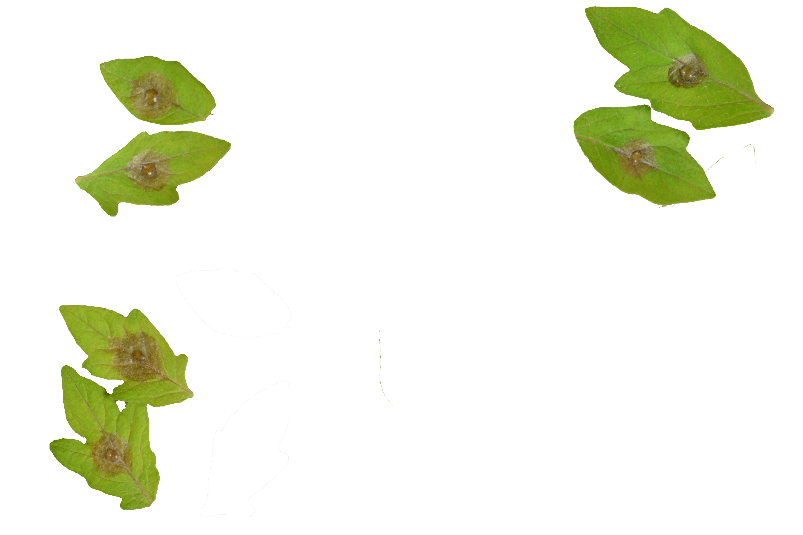

# Colour-analyzer: A new dual colour model-based imaging tool to quantify plant disease
**Plants Methods 03 May 2024**
Mackenzie Eli William Loranger, Winfield Yim, Vittorio Accomazzi, Nadia Morales Lizcano,  Wolfgang Moeder, Keiko Yoshioka

Here below is the data used for Figures 1, 3 and 5 of the paper 
[Colour-analyzer: A new dual colour model-based imaging tool to quantify plant disease](https://plantmethods.biomedcentral.com/articles/10.1186/s13007-024-01193-4)

Click to enlarge and get to the raw data.

## Figure 1
name | image | Treatment1 | Treatment2 |
|----| -------- | -------- | -------- |
|AB|   |   |  |
|CD|   |   |  |

| | | | |
|----| -------- | ---| ----|
|[A Row Data (csv)](Figure1/Fig_1A_RawData.csv)| [B Row Data (csv)](Figure1/Fig_1B_RawData.csv)|[C Row Data (csv)](Figure1/Fig_1C_RawData.csv)| [D Row Data (csv)](Figure1/Fig_1D_RawData.csv)|

## Figure 3
| image | measurements |
|-------|------------- |
|| [csv](Figure3/Fig_3_RawMeasurments.csv) | 

## Figure 5
|image|Ecoli|Mock|WCS374|
|-----|-----|----|------|
|A||||
|B||||

[Figure 5 row data (csv)](Figure5/Fig_5_RawData.csv)
